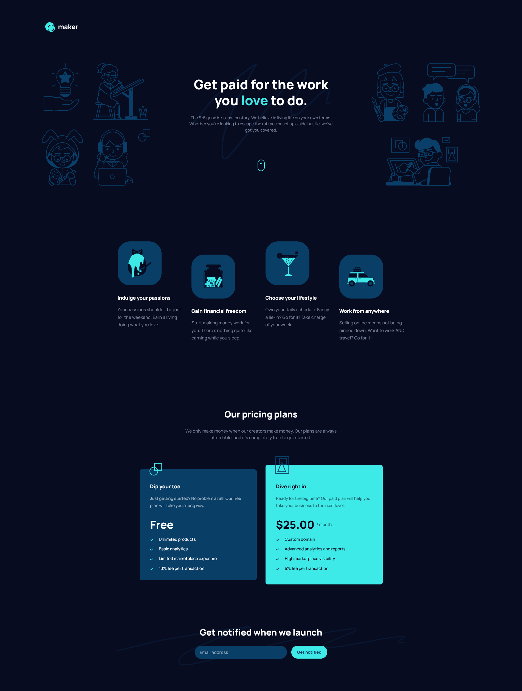

# Frontend Mentor - Maker pre-launch landing page solution

This is a solution to the [Maker pre-launch landing page challenge on Frontend Mentor](https://www.frontendmentor.io/challenges/maker-prelaunch-landing-page-WVZIJtKLd). Frontend Mentor challenges help you improve your coding skills by building realistic projects. 

## Table of contents

- [Overview](#overview)
  - [The challenge](#the-challenge)
  - [Screenshot](#screenshot)
  - [Links](#links)
- [My process](#my-process)
  - [Built with](#built-with)
  - [What I learned](#what-i-learned)
- [Author](#author)


## Overview

### The challenge

Users should be able to:

- View the optimal layout depending on their device's screen size
- See hover states for interactive elements
- Receive an error message when the form is submitted if:
  - The `Email address` field is empty should show "Oops! Please add your email"
  - The email is not formatted correctly should show "Oops! That doesn’t look like an email address"

### Screenshot




### Links

[Live Site URL](https://maker-pre-launch-landing-page-mbart13.vercel.app)

## My process

### Built with

- Semantic HTML5 markup
- SASS
- Flexbox
- Parcel
- Mobile-first workflow


### What I learned

First of all I learned to better organize my folder structure into abstracts, base, components etc. Probably could have been better, but helped me during work when I needed to find something quickly and I will try to follow this approach with non-React projects.  

I tried to follow BEM methodology and still learning that. I aimed at creating reusable components, for example pricing-plan card.  
One fragment that I would like to show  is this one, where I created generic class "pricing-plan" and 2 modifying classes "pricing-plan--free" and "pricing-plan--paid" which differ in some visual aspects:


```css
.pricing-plan--free {
  background-color: $color-primary;
  color: $color-white;

  &::before {
    background: url('../assets/icon-free.svg');
    width: 2.875rem;
    height: 2.875rem;
  }
}

.pricing-plan--paid {
  background-color: $color-accent;
  color: $color-bg;
  padding: 4rem 2.40625rem 3rem;

  &::before {
    background: url('../assets/icon-paid.svg');
    width: 3.1875rem;
    height: 4.0625rem;
  }
}

.pricing-plan--free .pricing-plan__feature::before {
  background: url('../assets/icon-check-free.svg') no-repeat;
}

.pricing-plan--paid .pricing-plan__feature::before {
  background: url('../assets/icon-check.svg') no-repeat;
}

.pricing-plan--free .pricing-plan__text {
  color: rgba($color-white, .6);
}

.pricing-plan--paid .pricing-plan__text {
  color: rgba($color-bg, .6);
}
```


## Author

- Frontend Mentor - [@mbart13](https://www.frontendmentor.io/profile/mbart13)
